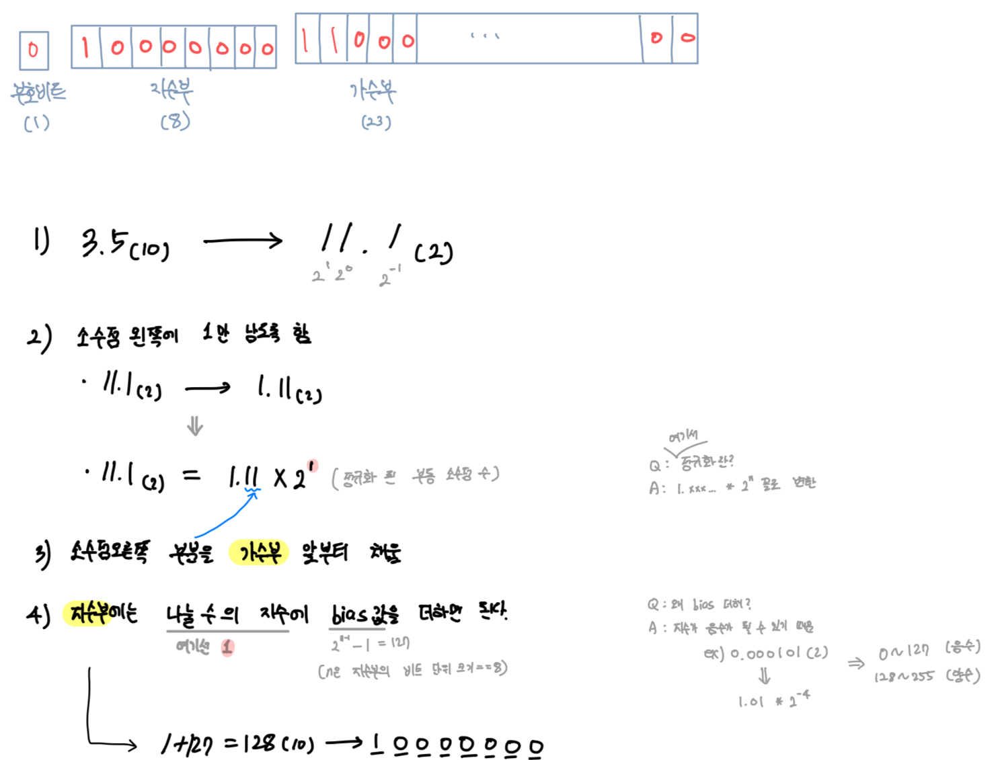

# 6장. 에러 처리

<aside>
✅ 에러 처리를 구현하는 방법

1. 반환값으로 실패 전달
2. 실패하면 점프
</aside>

1. 반환값으로 실패 전달
    - 문제점 1) 실패를 놓침 
    -  반환값을 확인하지 않고 넘어간 경우 시한폭탄이 된다.
    -  다른 사람이 봤을 때 어떤 반환값이 에러인지 모를 수 있다.
    - 문제점 2) 에러 처리 때문에 코드 해석 어려움 (가독성)

1. 실패하면 점프한다
    - 에러가 발생했을 때 점프할 장소를 사전에 등록해두는 방법

<aside>
✅ finally 도입 이유

</aside>

- microsoft에서 도입 시작
- ‘리소스를 바르게 닫는 것’ 즉, 짝이 되는 처리가 반드시 실행되도록 함

> 칼럼 (생각 정리) : 새로운 것을 공부할 때 자신은 어떤 방법으로 하는가?
1. 필요한 부분부터 흡수한다.
2. 대략적인 부분을 잡아서 조금씩 상세화 한다.
3. 끝에서부터 차례대로 베껴간다.
이러한 대답은 자신이 어떻게 효율적으로 공부할 수 있는지를 보여줄 수 있는 내용인 것 같다.
> 

> 칼럼 (반성하기) : 완벽주의의 방해
나는 ’필요한 부분부터 흡수한다’에서 전체를 모두 읽지 않는 것을 싫어한다.
’전부 읽지 않으면’이라는 완벽 주의가 배우고자 하는 동기를 짓누르고 있다면, 버려야 한다. 
따라서, 읽고 싶은 부분이 어디인지 대략적으로 전체적읜 구조를 파악하는 것부터 해보자
> 

<aside>
✅ 정리

</aside>

1. 알기 쉬운 코드
2. 처리하기 쉬운코드 
3. 실수하지 않게 하는 코드
- 저자는 위의 3가지를 중점적으로 말하고 있다.
- 프로그램도 실패하는 때가 있다. 따라서 어떻게 처리를 하고 발전해왔는지 배웠다.

# 7장. 이름과 스코프

동적 스코프, 정적 스코프?

- 정적 스코프
    - 변수의 유효 범위가 코드의 물리적인 구조에 의해 결정됨
    - 변수가 선언된 위치에서 ~ 포함된 블록 내에서 유효
    - C, C++, Java, Pyhon
- 동적 스코프
    - 변수를 사용하는 시점의 실행 경로에 따라 결정
    - 범위는 동적으로 변경

- Java는 정적 스코프 언어인데,,, 동적 스코프와 닮은게 있다?
    - 접근 지시자: 호출처에서 변경한 것이 호출한 곳에 영향을 끼치는 것과 닮았다.

<aside>
✅ 정리

</aside>

- 우리가 당연하게 생각했던 변수명, 지역변수, 전역변수 등등 의 흐름들은 많은 시행착오를 겪고 나온 것이다.
- 따라서, 앞으로도 우리가 지금 사용하고 있던 방법들이 발전하면서 새롭게 바뀔 수 도 있을 것 같다.

# 8장. 형

- 형이란? 사람이 데이터에 붙인 ‘추가 데이터’
- 숫자를 짧고 간단하게 표현하기 위해 2진수 까지 발전 되었다.
- 그렇다면 실수는?
    - 고정 소수점은 소수점의 위치를 바꿔주기 힘들어 잘 사용하지 않는다.
    - 부동 소수점 - 어디부터 소수부인지의 정보 자체를 값에 포함시킨다. (소수점이 이동하기 때문에 ‘부동 소수점’ 이라고 불린다.
        - IEEE 754 표준화 (대부분 언어가 사용)
        - 단, 무한 소수가 되어버리면 계산에 오차가 생겨 버림. 특히, 돈을 다루는 분야에서는 주의해야 함. 
        해결 방법으로는 2가지를 소개해줌
            1. 고정 소수점수
            2. Excess-3 과 같은 10진수 계산법을 이용
            - 자바에서는 정수, 소수 모두 10진수로 처리하는 BigDecmal을 사용
- 형이 없으면?
    - 컴퓨터는 어떻게 계산할 지 모름
- 형 == 사양
    - 공개와 비공개
    - 인터페이스로 발전
    - 제네릭스 (형이 인수를 가지고 형을 만드는 함수)

> 알고리즘 용어의 유래
인도에서 발명 → 아라비아를 경유해 유럽에 전달되어 지금은 ‘아라비아 숫자’라고 불리고 있다.
년대를 알고 있는 것 중에는 al-khwarizimi 의 ‘인도 수 계산법’이 가장 오래되었다. 그의 이름은 라틴어로 Algoritmi로 표기한다.
>
